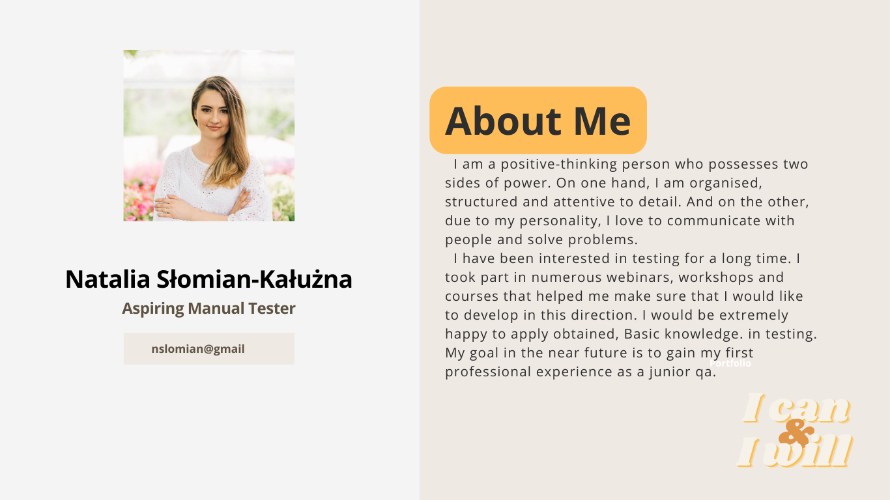

# Portfolio

  

## Connect with me
 

 
 

 
 
    
 
  
## Tools

* Jira - bug tracker
* Slack - for communication within the team
* Chrome DevTools - for testing and to improve bug reports
* Xampp - for SQL database
* HTML/CSS - basics

## Courses, Workshops, Webinars

* Bezpłatny Maraton GoIT HTML/ CSS - czerwiec 2022
* Podstawy manualnego testowania oprogramowania. Udemy
* Dare IT Challenge - Manual Testing, styczeń - luty 2023
* Konsola Deweloperska, szkolenie dla QA (Adam Gola), luty 2023
* Dzień Kobiet IT Future Collars 2022 - Warsztaty Testowania
* Szkolenie Tester IT - Marek Koszałka, listopad 2022
* Dare IT - Zbuduj swoją samoskuteczność, luty - marzec 2023

## Podcasts

* "Po szklanie i na testowanie"
* "Testing Parrot"
* "Forbes Women Podcast"
* "Strefa Technologii Uniwersytetu SWPS"
* "Porozmawiajmy o IT"

## Projects

 <b>[Projekt CV (Go IT)](https://hilarious-elf-d868e2.netlify.app)</b> 
<b>[Dare IT Challenge](https://drive.google.com/drive/folders/1hv4sjuAChRSaTRl_-uUqe_qSAYfsrssU?usp=share_link)</b>

## Books

1. Certyfikowany tester Sylabus poziomu podstawowego ISTQB
2. Adam Roman, Lucjan Stapp "Certyfikowany tester ISTQB Poziom Podstawowy"
3. Smilgin Radosław "Zawód Tester. Od decyzji do zdobycia doświadczenia"

## IT Groups on Social Media

<b>Facebook:</b>
1. [Testuj, Dziewczyno!](https://www.facebook.com/groups/514014750879165)
2. [Praca w IT dla Stażystów i Juniorów](https://www.facebook.com/groups/1561984417428846)
3. [IT na szpilkach](https://www.facebook.com/groups/167581263832966)
4. [Tester oprogramowania - wsparcie na starcie](https://www.facebook.com/groups/417833158717454)
5. [Praca zdalna IT](https://www.facebook.com/groups/268603053543086)
6. [Zostań Testerem Manualnym](https://www.facebook.com/groups/zostan.testerem.manualnym)

<b>Instagram:</b>
1. [Akademiaqa.pl](https://www.instagram.com/akademiaqa.pl/)
2. [dareit.community](https://www.instagram.com/dareit.community/?hl=pl)
3. [majka.testerka](https://www.instagram.com/majka.testerka/)
4. [mentor_testowania_opr](https://www.instagram.com/mentor_testowania_opr/)
5. [mygeeksisters](https://www.instagram.com/mygeeksisters/)

## Blogs

* [Testerzy.pl](https://testerzy.pl/)
* [Testuj.pl](https://testuj.pl/)
* [Tester. MilenaBednarczyk](https://tester.milenabednarczyk.pl/)

